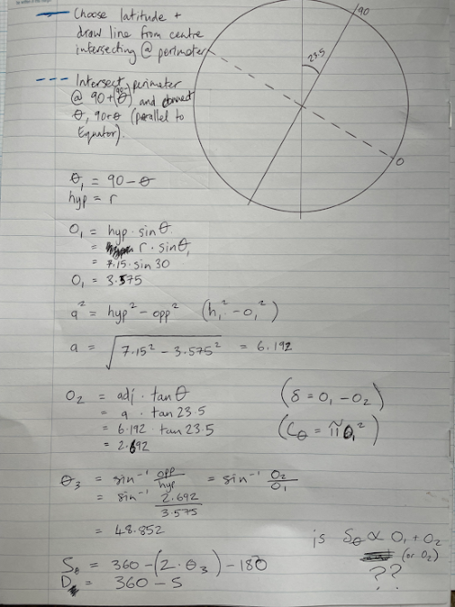

```{r setup, include=FALSE}
knitr::opts_chunk$set(echo = TRUE)
```

## Abstract

My partner has Seasonal Affective Disorder and the dark days of winter really affect her. To cheer her up I decided to try an show her how, coming out of winter, that the length of the day will increase fairly rapidly through spring settling into the long days of summer.

I decided that I could do this with a bit of geometry and some code.


## Introduction and Methods

Our planet earth is spheroidal, and so circles suffice to summarise it in two dimensions on paper. It is the axial tilt of 23.5 degrees that is primarily responsible for seasonality. That seasonality becomes greater within a year as latitude (or the distance from the equator) increases.

Drawing a circle and the tilted axis of rotation, the points of intersection become the true poles at 9O degrees N and S, respectively. The equator in our schematic is a line that runs perpendicular (at 90 degrees) to axis of rotation, and that is 0 degrees. We also draw a vertical line through the circle. This symbolises the two sides of earth; one half receiving light from the sun, and one half in darkness. From there we can pick a latitude. In the example, it is 60 degrees north.


Using a protractor we can find 60 degrees from the origin at the centre of the circle (and equator) and see where it intersects. We then find the equivalent point on the other side of the circle (using either a compass or protractor) and then we connect those two points with a line which again will be parallel to the equator, and perpendicular to the axis of rotation. This gives the path along which 60 degrees north will travel. 

The point at which the line intersects the vertical light/dark line signifies day and night. We can see that at 60N that a much larger proportion of that line is in the light half than the dark half. At least this is how it is at summer solstice. It is the opposite way around at winter solstice.

Earth, being a (near enough) sphere, means that the line we've drawn connecting 60 degrees latitude can be turned into a circle, and so this becomes a juxtaposed view from the axis of rotation. If we then draw a line parallel to the axis of rotation that intersects the light/dark line, then the points at which that line intersects our 60N circle gives the periods that 60N will experience in terms of light and dark: lightness on the sun-facing side of the circle, and conversely darkness on the side facing away. (Remember this is at the summer solstice.)

Now we can do a bit of trigonometry to find out the proportion of the circle that experiences light and the proportion that experiences dark.



So now we have some equations, we can fit that into code!

## R code

First we're going to define some functions. d2r and r2d variously convert degrees to/from radians.

```{r degs and rads}
d2r <- function(x){x / 180 * pi}

r2d <- function(x){x * 180 / pi}
```

This function is just a coded version of what was worked out on paper in Figure 2.

```{r max day length}
max_day_length <- function(latitude, radius = 5, verbose = T){
  axial_tilt <- 23.5
  theta1 <- 90 - latitude
  radius_at_latitude <- radius * sin(d2r(theta1))
  adj <- sqrt(radius^2 - radius_at_latitude^2)
  opp2 <- adj * tan(d2r(axial_tilt))
  if(opp2 > radius_at_latitude){
    theta2 <- 90
  } else {
    theta2 <- r2d(asin(opp2 / radius_at_latitude))
  }
  
  S_arc <- 180 + (2 * theta2)
  D_arc <- 360 - S_arc
  
  S_dur <- S_arc / 360 * 24
  D_dur <- 24 - S_dur
  
  if(verbose){
    print(paste0("Max day length: ", round(S_dur, 1)))
    print(paste0("Min night length: ", round(D_dur, 1)))
  } else {
    S_dur
  }
}
```

So let's try the code! So for a latitude of 50N (or 50S), maximum day length is:

```{r trying the code}
my_lat <- 50
max_day <- max_day_length(my_lat, 5, verbose = F)
min_day <- 24 - max_day
max_day_length(my_lat, verbose = T)
```

At the summer solstice, our model calculates that the day lasts 16.2 hours, and consequently the night (24 - daylight hours) is 7.8 hours. As this is just the extremes at the solstices, we now need to build in the precession of the seasons. Our function gives the maximum and minimum day length, so we just need to interpolate the times in-between. The change in day length is not linear (the change in day length is constant from day to day) but rather the rate changes from near-steady states at the solstices where it doesn't change much, to the equinoxes where change is greatest. We can model this rate of change using a sin wave, like this. First, I'll just define a quick function for finding a proportional value within a range which I use to convert a value of y = sin(x) into a day of the year:

```{r inRange function}
inRange <- function(x, value = 0.5){
  # quickly find proportions of a vector, useful for plotting!
  # excludes NAs
  stopifnot(is.numeric(x) | lubridate::is.Date(x))
  if(lubridate::is.Date(x)){
    was.Date <- T
    x <- as.numeric(x)
  } else {
    was.Date <- F
  }
  out <- sapply(value, function(v){min(x, na.rm = T) + ((max(x, na.rm = T) - min(x, na.rm = T)) * v)})
  if(was.Date){
    as.Date(out, origin = "1970-01-01")
  } else {
    out
  }
}
```

And to plot what that looks like:

```{r sin wave}
x <- seq(0, 2 * pi, length.out = 367)[1:366]
y <- sin(x)
y = (y + 1) / 2 # so that range [0, 1]
y <- inRange(c(min_day, max_day), y)
plot(x, y, type = "l")
```

So using this sin wave as a basis, we reorder it so line up with solstices. I just need to load a couple more functions, one for converting days/hours values to hours/minutes and a lazy plotting function I use to control the plot margins. I also like axis ticks on the inside, so there's a function for that. Also, loading <b>dplyr</b> so I can use the pipe %>% for easier coding and <b>stringr</b> for string manipulation.

```{r convert days/hours to hours/mins}
dh2hm <- function(x){
  y <- round(x, 2) %>% str_split("\\.") %>% unlist() %>% as.numeric()
  if(length(y) > 1){
    y[2] <- round(y[2] / 10 ^ nchar(y[2])  * 60, 0)
    paste0(y[1], "H ", y[2], "M")
  } else {
    paste0(y[1], "H")
  }
}

mar <- function(s = 5.1, w = 4.1, n = 4.1, e = 2.1){
  par(mar = c(s, w, n, e))
}

internal_axis_ticks <- function(draw.axes = 1:4, number.axes = 1:2, ...){
  for(n in draw.axes){
    axis(n, tck = 0.01, labels = NA, ...)
  }
  for(n in number.axes){
    axis(n, lwd = 0, line = -0.5, las = 1, ...)
  }
  box(lwd = 1.5)
}


library(dplyr)
library(stringr)
```

And we get this:

```{r main plot}
winter_solstice <- which.min(y)
y <- y[c((winter_solstice + 1):366, 1:winter_solstice)]
par(pty = "m")
mar(w = 5.1, s = 4.1)
plot(x, y, type = "n", ylim = inRange(c(min_day, max_day), c(0, 1.2)), las = 1, axes = F, xlab = "", 
     ylab = paste0("Day length (h)  @ ", my_lat, "\u00b0"), cex.lab = 1.5)
abline(h = 12, col = "darkgrey", lty = 2)
abline(v = x[c(1, 92, 366 * 0.5, 366 * 0.75)], col = "darkgrey")
mtext(3, 1, at = x[1], text = "Winter\nsolstice")
mtext(3, 1, at = x[92], text = "Spring\nequinox")
mtext(3, 1, at = x[round(366 * 0.5, 0)], text = "Summer\nsolstice")
mtext(3, 1, at = x[round(366 * 0.75)], text = "Autumn\nequinox")
text(x[round(inRange(c(1, 366), c(0, 0.25, 0.5, 0.75)), 0)], 18.5, labels = sapply(y[round(inRange(c(1, 366), c(0, 0.25, 0.5, 0.75)), 0)], dh2hm), col = "darkred")
points(x, y, col = "#00000099")

year_dates <- data.frame(ymd = seq(as.Date("2023-12-21"), as.Date("2024-12-20"), by = 1))
year_dates$doy <- year_dates$ymd %>% str_split("-") %>% sapply("[[", 3)
month_starts <- which(year_dates$doy == "01")
months <- c("Jan\n", "Feb\n", "Mar\n", "Apr\n", "May\n", "Jun\n", "Jul\n", "Aug\n", "Sep\n", "Oct\n", "Nov\n", "Dec\n")
points(x[month_starts], y[month_starts], pch = 16)
arrows(x[month_starts], y[month_starts], x[month_starts], y[month_starts] + 0.5, length = 0)
text(x[month_starts], y[month_starts], months, pos = 3)
#mtext(2, 1.5, at = inRange(c(-1, 1.2), 0.5), text = "Relative change in day length", cex = 1.5)
mtext(1, 1.5, at = inRange(x, 0.5), text = "Day of solar year", cex = 1.5)
today <- which(year_dates$ymd == Sys.Date())
#today <- which(year_dates$ymd == "2024-03-24")
points(x[today], y[today], pch = 16, col = "darkred")
text(x[today], y[today], paste0("Today: ", dh2hm(y[today])), pos = ifelse(today > 366/2, 2, 4), col = "darkred")
internal_axis_ticks(2, 2)
box()
```

And there we go, our model predicts that the day length at 50N on 16th April 2024 will be 13 hours, 48 minutes. This can be checked against a weather app or website.

## Conclusion

Whilst not perfect (you might find that checking against an app), it gives a pretty decent approximation of day length for latitude. The shape of the wave should actually vary depending on latitude; the poles experience 100% light or dark at certain times of the year, and there would be no variation at the equator. Hopefully I'll get the time to plug that in at some point.
